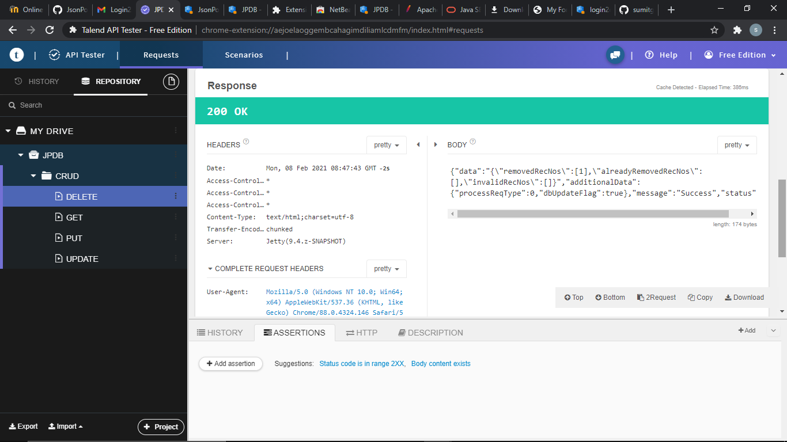
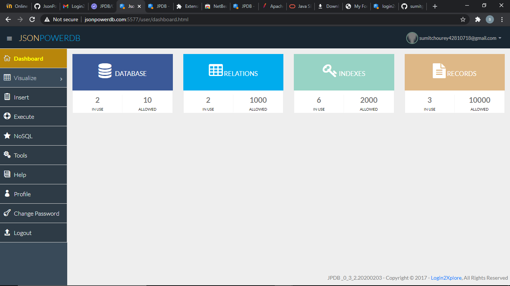
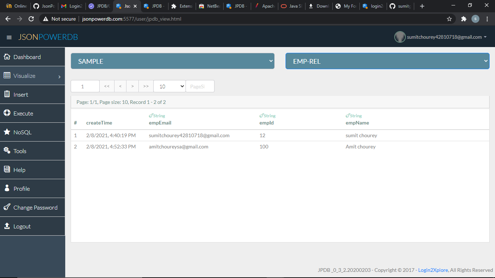
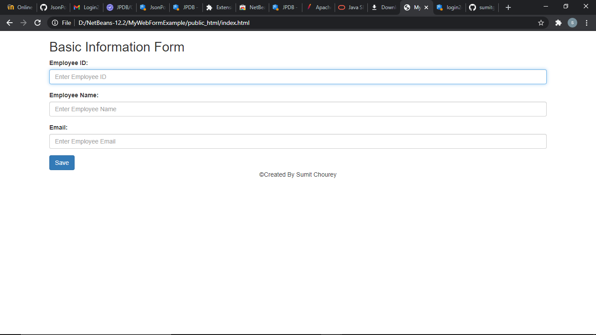

# myLogin2XForm.github.io

myLogin2XForm.github.io
"This project is all about basics of JsonPowerDB (JPDB) and how to use JPDB for CRUD operations." About JsonPowerDB: JsonPowerDB is a Real-time, High Performance, Lightweight and Simple to Use, Rest API based Multi-mode DBMS. JsonPowerDB has ready to use API for Json document DB, RDBMS, Key-value DB, GeoSpatial DB and Time Series DB functionality. JPDB supports and advocates for true serverless and pluggable API development. Benefits of using JsonPowerDB Simplest way to retrieve data in a JSON format. Schema-free, Simple to use, Nimble and In-Memory database. It is built on top of one of the fastest and real-time data indexing engine - PowerIndeX. It is low level (raw) form of data and is also human readable. It helps developers in faster coding, in-turn reduces development cost.

JPDB API Command Reference Language Syntax < . . . > - User specified value. << . . . >> - Optional parameter, may take default value if not used.

Connection Token - Connecting to JPDB API.
Connection-token is used to interact with JsonPowerDB, it must be included in every request of jsonPowerDB for security purpose.

How to get the 'connection-token' from JsonPowerDB :
Login to JPDB API Dashboard . Click on Tools option on left navigation . Select Tokens panel and then select 'connection-token' option from dropdown , Copy the 'connection-token' from the Token table. And if there is no 'connection-token' in the token table or if you want to generate a new 'connection-token', click on the Generate Connetion_Token button as It will generate a new-connection token. Copy the newly generated 'connection-token' from token table.

What is AJAX 
● AJAX = Asynchronous JavaScript And XML. 
● AJAX is not a programming language. 
● AJAX just uses a combination of: ○ A browser built-in XMLHttpRequest object (to request data from a web server) ○ JavaScript and HTML DOM (to display or use the data)

HttpRequest is a server side object that represents a request to the server. XMLHttpRequest in a standard javascript object that allows you to make HTTP Requests from the browser in javascript. In summary - one works in the browser, the other in the web server. They also have completely different roles. XMLHttpRequest is for fetching web resources within the browser. HttpRequest represents an incoming request. The XMLHttpRequest object can be used to request data from a web server. ● Update a web page without reloading the page ● Request data from a server - after the page has loaded ● Receive data from a server - after the page.

Use cases :-

All Mobile applications that require backend database. Session Caching. Page Caching. Existing Database applications to improve their reporting / analytics performance. Best suited as backend Database for IoT. Live HTML templates / themes. Any software application that needs backend database. Products To suit every application’s backend database requirements. Shared JPDB - free / low cost DBSaaS: Click here to register now. Downloadable and freemium JPDB instance: Click here to download. Dedicated JPDB instances: Contact Us Customized JPDB as per requirement: Contact Us Features JsonPowerDB (JPDB) is Next Generation, Creative and Disruptive Multi-mode DBMS_ with many USPs. Proprietary algorithm for High Performance CRUD operations. Multiple times faster than popular DBMS. Serverless support for faster development - A UI developer can develop complete dynamic application. DBMS with built in web / application server and embedded caching makes the performance lightning fast. Server side Native NoSQL - best query performance. In-built support to query on multiple JPDB databases. Multi-mode DBMS - Document DB, Key-Value DB, RDBMS support. Schema free - easy to develop and maintain. Web-services API - Can be used with any programming language that has support for HTTP. Enriched by a pluggable API Framework - A developer can develop a pluggable API and plugin into any of our cloud JPDB instance. Standardisation of API development framework makes the development process easy, more readable, and less error prone. Multiple security layers. Nimble, Simple to use, In Memory, Real-time DBMS. Release Notes v0.3.2.20201008.2215 beta

JsonPowerDB
Documentation Link

"This project is all about basics of JsonPowerDB (JPDB) and how to use JPDB for CRUD operations."
About JsonPowerDB:
JsonPowerDB is a Real-time, High Performance, Lightweight and Simple to Use, Rest API based Multi-mode DBMS. JsonPowerDB has ready to use API for Json document DB, RDBMS, Key-value DB, GeoSpatial DB and Time Series DB functionality. JPDB supports and advocates for true serverless and pluggable API development.
Benefits of using JsonPowerDB
Simplest way to retrieve data in a JSON format.
Schema-free, Simple to use, Nimble and In-Memory database.
It is built on top of one of the fastest and real-time data indexing engine - PowerIndeX.
It is low level (raw) form of data and is also human readable.
It helps developers in faster coding, in-turn reduces development cost.

<html>
<body>
   <h1>Screenshoots</h1>
   
   
   
   
</body>
</html>

